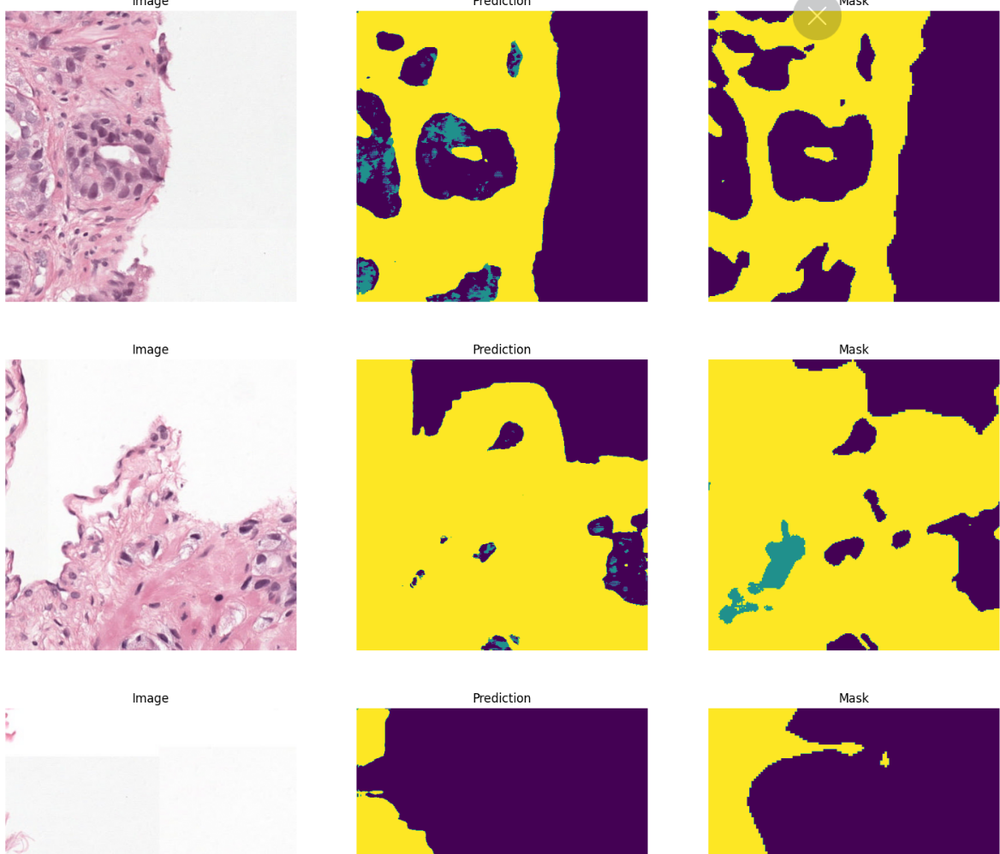
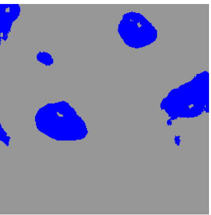

# Medical Image Segmentation
The resolution of image is very high ! 
After going through literature it seems such high resolutions are very common in medical images.  


## How to deal with such high resolution?

The literature suggests to use patches of images. No model could take such high resolution image at once.  It is to be ensured that image and mask are patched similarly. The patched image must have a corresponsing patched mask. 

I patched the images using patchify library of python.  

Please refer patch.ipynb

## How to read the image?

I couldn't even open few images in MS Paint to have a guess at dimension of patch needed.

The PIL library  was having trouble in handling such resolutions.

```
DecompressionBombError: Image size (242221056 pixels) exceeds limit of 178956970 pixels, could be decompression bomb DOS attack.
```

setting this flag resolved the error.  https://github.com/Belval/pdf2image/issues/76
```python
from PIL import Image 
Image.MAX_IMAGE_PIXELS = 1000000000 
```
## Mask Preparation

### Why 512 x 512 ?
The size of the patch should be such that it should cover atleast the particles ( cells) in full.

512 X 512 seemed reasonable size which covered the particles in full.  

( I didn't go for higher resolution thinking of memory constraint on Colab. But a  higher resolution could have been been used on colab.)

We could go for a higher resolution to increase receptive field and accuracy.

Used Patchify to do same. 

## Removing patches carrying no information
Done this to reduce dataset size. There were many masked patches with only background.

The source code for same is there in: patch.ipynb

## Dataset and Dataloader
```python
class BiopseDataset(data.Dataset): 
```
Used the regular Dataset class from pytorch. Just needed to add an additional function to convert RGB mask to 1-Channel pytorch tensor.

```python

COLORMAP = [
        [0, 0, 0],
        [255, 255, 0],
        [150, 150, 150],
        [0, 255, 0],
        [0, 0, 255],
        [0, 150, 255] 
    ]

CLASSES = [
        'background',
        'yellow',
        'grey',
        'green',
        'blue',
        'red'
    ]

def process_mask(self, rgb_mask):
```
process_mask function gives a 2d tensor. Let say the pixel was red [255, 255, 0] in original mask. It would be enumerated wrt COLORMAP. The corresponding value in 2D tensor would be 5.


## Model
### Which model to use?
As far I remember U-Net architecture is considered good for medical image segmentation.  So, I chose U-Net.

### Where to get U-Net architecture implemented?
Just found it on Kaggle. 

### Why kaggle?
I could give a dry run of the model in kaggle itself to check working condition of the model.

( It is not recommended to use models off the shelve from Kaggle. If going for production, a much more peer reviewed model from GitHub would be a good pick )


### Performance metrics
#### Dice Score

```python
dice_score = (2 * (preds * y).sum()) / ((preds + y).sum() + 1e-8)
```

### Training


### Validation


#### Attempt 1

Here equal weightage was given to all labels.

<br>
</a>
<br>
<br>

Red and Green regions were not coming perfectly.

#### Attempt 2

```python
class_weights=torch.tensor([0.1, 0.9, 0.9, 0.9, 0.9, 0.9],dtype=torch.float).to(DEVICE)

ce_loss_fn = nn.CrossEntropyLoss(weight=class_weights)
```

Decreased the weightage of background pixels in CrossEntropy loss calculation.

<br>
</a>
<br>
<br>

This attempt failed. I forgot that black patches were already removed from my dataset.  And keeping a very low weightage for background jeopardized model training wrt background. 


#### Attempt 3

Decreased weightage of yellow and gray regions. 

```python
class_weights=torch.tensor([0.5, 0.7, 0.7, 0.9, 0.9, 0.9],dtype=torch.float).to(DEVICE)

ce_loss_fn = nn.CrossEntropyLoss(weight=class_weights)
```


| Validation Image                                                                                        | Dice Score | 
| -------------------------------------------------------------------------------------------- | --------------------- | 
|0f958c8bbbc828b2e043e49ea39e16e2.png|0.37|
|6bb4cd81976d643a0fdb67c50636d01c.png|0.66|
|623155cecfa8cc671054be004d6cb2cf.png|0.49|


### Final call

#### What is wrong with the model?
1.  The model seems to underfit.  Red, Green and Blue regions.
2. Yellow regions showing up dominantly. 

#### What could be done ?
1. Selecting a higher resolution.  Patching reduces the receptive field. May be a higher resolution could lead to higher recptive fields.
2. Should try other loss functions ex. focal loss, dice loss, Jaccard/IOU loss
3. Included better augmentations.  Atleast flip and rotations. This dataset is not direction sensitive.
4. Is the model selection correct?  Should check against other medical segmentation models. I could find U-Net or Flavours of U-Net mostly.
   https://www.cs.jhu.edu/~alanlab/Pubs21/chen2021transunet.pdf  Yr-2021  claims Transformer as encoder is doing good job. 


## Source code and related files

|                                                                        Purpose               |  filename  | 
| -------------------------------------------------------------------------------------------- | --------------------- | 
|patch preparation for training|patch.ipynb|
|model train/ dataloader/ visualization|unet.ipynb|
|Inference on validation data and image wise dice score|output_patch.ipynb|
|Model weights|https://drive.google.com/file/d/1E8c_uIT_ianM2Q7Dvmnp1BzD5eLHQ_Bj/view?usp=sharing|
|Validation Masks (Model generated)|https://drive.google.com/drive/folders/15s0PO_XYq1-C3LYT2g6uK-UQd2dOn9Yx?usp=sharing|
|Train logs| train_log.txt, train_log-attempt-3.txt|


## References
Understanding important features of deep learning models for segmentation of high-resolution transmission electron microscopy images
https://rdcu.be/c8YtO

https://github.com/nikhilroxtomar/RGB-Mask-to-Single-Channel-Mask-for-Multiclass-Segmentation/blob/main/rgb_mask_to_single_channel_mask.py

Architecture:
https://www.kaggle.com/code/vikram12301/multiclass-semantic-segmentation-pytorch

Image patching : https://levelup.gitconnected.com/how-to-split-an-image-into-patches-with-python-e1cf42cf4f77

## Issues
DecompressionBombError: Image size (242221056 pixels) exceeds limit of 178956970 pixels, could be decompression bomb DOS attack.

https://github.com/Belval/pdf2image/issues/76


Unable to find a valid cuDNN algorithm to run convolution

https://stackoverflow.com/questions/61467751/unable-to-find-a-valid-cudnn-algorithm-to-run-convolution